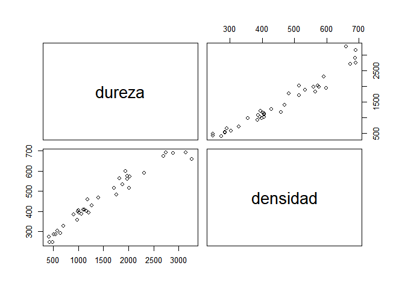
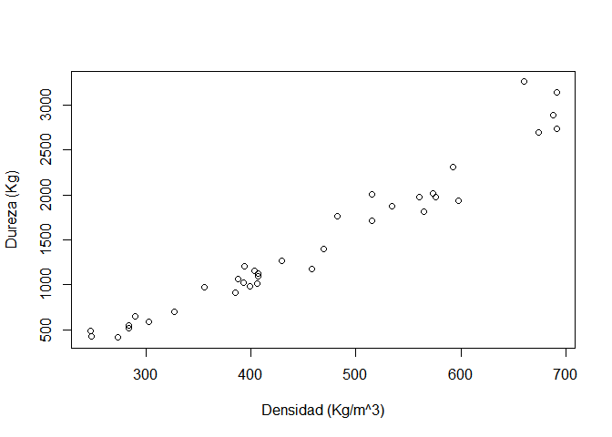
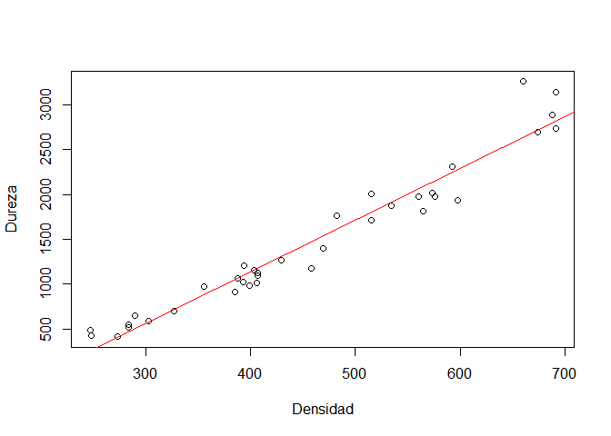
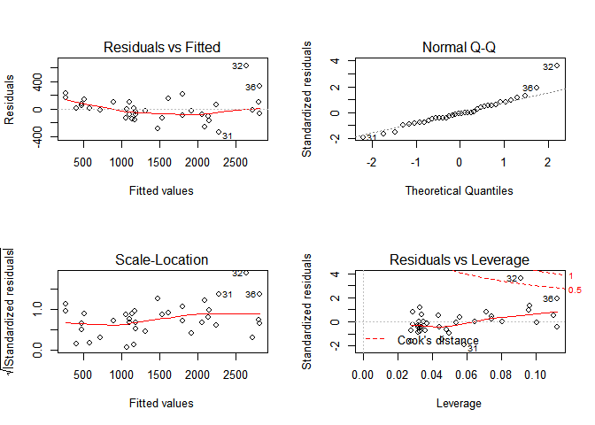
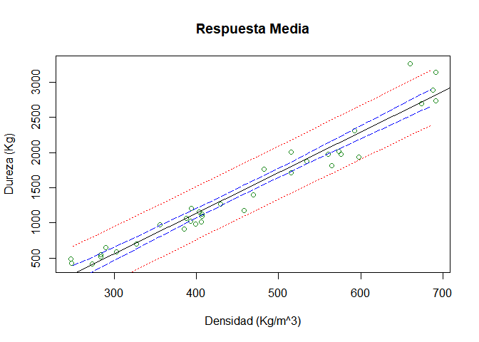

Regresion Lineal
================

David Triviño 16 de febrero de 2020

Descripción del problema
------------------------

La dureza de los árboles es dif?cil de medir directamente, sin embargo la densidad si es relativamente fácil de medir. Por ello es de gran inter?s disponer de un modelo que permita predecir la dureza de un ?rbol a partir de su densidad. Por este motivo se ha tomado una muestra de 36 eucaliptos australianos y se les midió su densidad (X) y su dureza (Y). Las variables x (Kg/m^{3}) y (Kg)

``` r
densidad=c(247,248,273,284,284,290,303,327,356,385,388,393,394,399,403,406,407,
    407,429,458,469,482,515,515,534,560,565,573,576,592,598,660,674,688,691,691)
dureza=c(484,427,413,517,549,648,587,704,979,914,1070,1020,1210,989,1160,1010,1100,
    1130,1270,1180,1400,1760,1710,2010,1880,1980,1820,2020,1980,2310,1940,3260,
    2700,2890,2740,3140)
datos=data.frame(dureza,densidad)
```

Análisis exploratorio
---------------------

``` r
pairs(dureza~densidad)
```

<!-- -->

``` r
plot(dureza~densidad,xlab="Densidad (Kg/m^3)",ylab="Dureza (Kg)")
```

<!-- -->

``` r
cor(datos) 
```

    ##             dureza  densidad
    ## dureza   1.0000000 0.9743345
    ## densidad 0.9743345 1.0000000

Modelo lineal
-------------

``` r
regresion<-lm(dureza~densidad,data=datos)
summary(regresion)
anova(regresion)
```

<table style="width:88%;">
<colgroup>
<col width="25%" />
<col width="15%" />
<col width="18%" />
<col width="13%" />
<col width="15%" />
</colgroup>
<thead>
<tr class="header">
<th align="center">
 
</th>
<th align="center">
Estimate
</th>
<th align="center">
Std. Error
</th>
<th align="center">
t value
</th>
<th align="center">
Pr(&gt;|t|)
</th>
</tr>
</thead>
<tbody>
<tr class="odd">
<td align="center">
<strong>(Intercept)</strong>
</td>
<td align="center">
-1160
</td>
<td align="center">
108.6
</td>
<td align="center">
-10.69
</td>
<td align="center">
2.066e-12
</td>
</tr>
<tr class="even">
<td align="center">
<strong>densidad</strong>
</td>
<td align="center">
5.751
</td>
<td align="center">
0.2279
</td>
<td align="center">
25.24
</td>
<td align="center">
1.333e-23
</td>
</tr>
</tbody>
</table>
<table style="width:86%;">
<caption>
Fitting linear model: dureza ~ densidad
</caption>
<colgroup>
<col width="20%" />
<col width="30%" />
<col width="12%" />
<col width="22%" />
</colgroup>
<thead>
<tr class="header">
<th align="center">
Observations
</th>
<th align="center">
Residual Std. Error
</th>
<th align="center">
<span class="math inline"><em>R</em><sup>2</sup></span>
</th>
<th align="center">
Adjusted <span class="math inline"><em>R</em><sup>2</sup></span>
</th>
</tr>
</thead>
<tbody>
<tr class="odd">
<td align="center">
36
</td>
<td align="center">
183.1
</td>
<td align="center">
0.9493
</td>
<td align="center">
0.9478
</td>
</tr>
</tbody>
</table>
<table style="width:89%;">
<caption>
Analysis of Variance Table
</caption>
<colgroup>
<col width="22%" />
<col width="6%" />
<col width="15%" />
<col width="15%" />
<col width="13%" />
<col width="15%" />
</colgroup>
<thead>
<tr class="header">
<th align="center">
 
</th>
<th align="center">
Df
</th>
<th align="center">
Sum Sq
</th>
<th align="center">
Mean Sq
</th>
<th align="center">
F value
</th>
<th align="center">
Pr(&gt;F)
</th>
</tr>
</thead>
<tbody>
<tr class="odd">
<td align="center">
<strong>densidad</strong>
</td>
<td align="center">
1
</td>
<td align="center">
21345674
</td>
<td align="center">
21345674
</td>
<td align="center">
637
</td>
<td align="center">
1.333e-23
</td>
</tr>
<tr class="even">
<td align="center">
<strong>Residuals</strong>
</td>
<td align="center">
34
</td>
<td align="center">
1139366
</td>
<td align="center">
33511
</td>
<td align="center">
NA
</td>
<td align="center">
NA
</td>
</tr>
</tbody>
</table>
### Figura del modelo

``` r
{plot(densidad,dureza)
abline(regresion)}
```

<!-- -->

### Residuales

``` r
{par(mfrow=c(2,2))
plot(regresion)}
```

<!-- -->

### Intervalos de confianza para B\_{0} y B\_{1}

``` r
confint(regresion,level=.95)
```

    ##                    2.5 %      97.5 %
    ## (Intercept) -1381.160010 -939.839397
    ## densidad        5.287614    6.213721

### Predichos y estimados

``` r
nuevas.den<-data.frame(densidad=seq(250,690,15))
IC<-predict(regresion,nuevas.den, interval="confidence")
IC.predict<-predict(regresion,nuevas.den, interval="prediction")
```

<!-- -->
