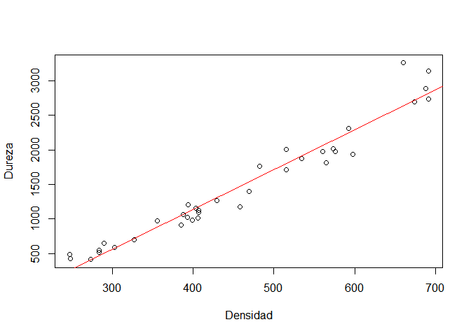

## Descripción del problema

La dureza de los árboles es dif?cil de medir directamente, 
sin embargo la densidad si es relativamente fácil de medir. 
Por ello es de gran inter?s disponer de un modelo que permita 
predecir la dureza de un ?rbol a partir de su densidad. 
Por este motivo se ha tomado una muestra de 36 eucaliptos 
australianos y se les midió su densidad (X) y su dureza (Y). 
Las variables x[Kg/m3] y[kg]


```r
densidad=c(247,248,273,284,284,290,303,327,356,385,388,393,394,399,403,406,407,
    407,429,458,469,482,515,515,534,560,565,573,576,592,598,660,674,688,691,691)
dureza=c(484,427,413,517,549,648,587,704,979,914,1070,1020,1210,989,1160,1010,1100,
    1130,1270,1180,1400,1760,1710,2010,1880,1980,1820,2020,1980,2310,1940,3260,
    2700,2890,2740,3140)
datos=data.frame(dureza,densidad)
```

## Análisis exploratorio


```r
pairs(dureza~densidad)
```

<!-- -->


```r
plot(dureza~densidad,xlab="Densidad (Kg/m^3)",ylab="Dureza (Kg)")
```

<!-- -->


```r
cor(datos) 
```

```
##             dureza  densidad
## dureza   1.0000000 0.9743345
## densidad 0.9743345 1.0000000
```

## Modelo lineal


```r
regresion<-lm(dureza~densidad,data=datos)
summary(regresion)
anova(regresion)
```


---------------------------------------------------------------
     &nbsp;        Estimate   Std. Error   t value   Pr(>|t|)  
----------------- ---------- ------------ --------- -----------
 **(Intercept)**    -1160       108.6      -10.69    2.066e-12 

  **densidad**      5.751       0.2279      25.24    1.333e-23 
---------------------------------------------------------------


--------------------------------------------------------------
 Observations   Residual Std. Error   $R^2$    Adjusted $R^2$ 
-------------- --------------------- -------- ----------------
      36               183.1          0.9493       0.9478     
--------------------------------------------------------------

Table: Fitting linear model: dureza ~ densidad


----------------------------------------------------------------
    &nbsp;       Df    Sum Sq    Mean Sq    F value    Pr(>F)   
--------------- ---- ---------- ---------- --------- -----------
 **densidad**    1    21345674   21345674     637     1.333e-23 

 **Residuals**   34   1139366     33511       NA         NA     
----------------------------------------------------------------

Table: Analysis of Variance Table

### Figura del modelo


```r
{plot(densidad,dureza)
abline(regresion)}
```

<!-- -->

### Residuales


```r
{par(mfrow=c(2,2))
plot(regresion)}
```

<!-- -->

### Intervalos de confianza para B_0 y B_1


```r
confint(regresion,level=.95)
```

```
##                    2.5 %      97.5 %
## (Intercept) -1381.160010 -939.839397
## densidad        5.287614    6.213721
```

### Predichos y estimados


```r
nuevas.den<-data.frame(densidad=seq(250,690,15))
IC<-predict(regresion,nuevas.den, interval="confidence")
IC.predict<-predict(regresion,nuevas.den, interval="prediction")
```

<!-- -->

